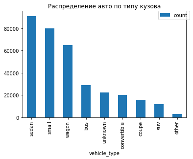
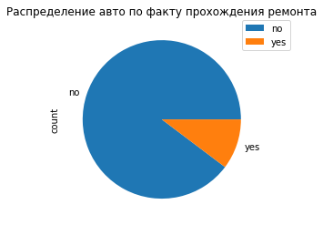
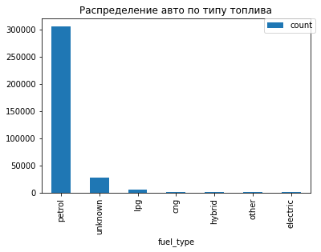
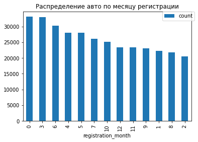
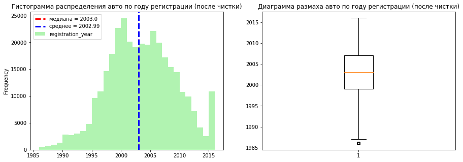
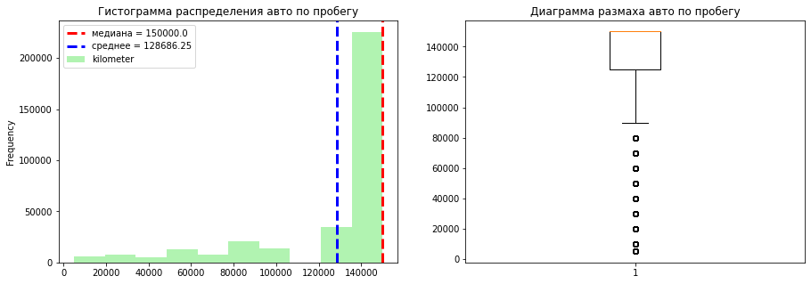
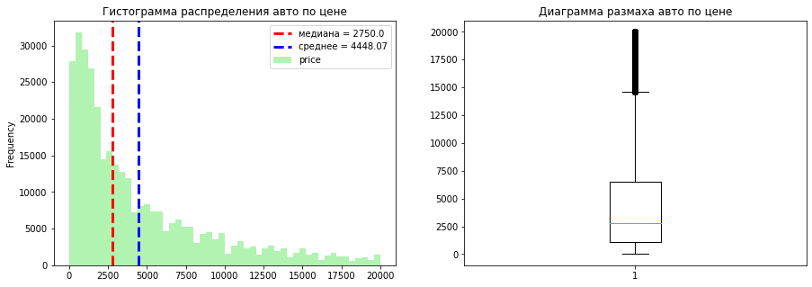
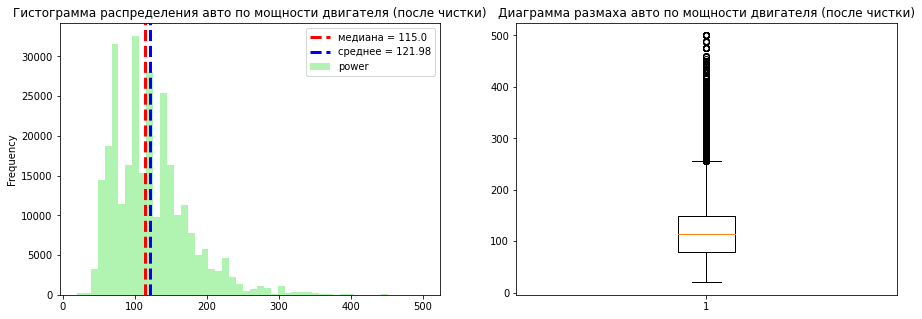

# Определение стоимости автомобилей

Сервис по продаже автомобилей с пробегом «Не бит, не крашен» разрабатывает приложение для привлечения новых клиентов. В нём можно быстро узнать рыночную стоимость своего автомобиля. В вашем распоряжении исторические данные: технические характеристики, комплектации и цены автомобилей. Вам нужно построить модель для определения стоимости. 

Заказчику важны:

- качество предсказания;
- скорость предсказания;
- время обучения.

## Подготовка данных


```python
!pip install phik
!pip install -U scikit-learn   
```

```python
#подключение необходимых библиотек

import warnings
import time

import pandas as pd
from math import sqrt

import numpy as np
import matplotlib.pyplot as plt
import seaborn as sns

from phik import report
from phik.report import plot_correlation_matrix

from sklearn.model_selection import train_test_split, GridSearchCV

from sklearn.pipeline import Pipeline
from sklearn.compose import ColumnTransformer

from sklearn.model_selection import KFold

from sklearn.preprocessing import OneHotEncoder, OrdinalEncoder, RobustScaler
from sklearn.impute import SimpleImputer

from sklearn.metrics import make_scorer
from sklearn.tree import DecisionTreeRegressor
from sklearn.linear_model import Lasso
from sklearn.dummy import DummyRegressor


from lightgbm import LGBMRegressor
from catboost import CatBoostRegressor

warnings.filterwarnings('ignore')
RANDOM_STATE = 61
TEST_SIZE = 0.25
```

### Загрузка данных и предобработка


```python
df = pd.read_csv('/datasets/autos.csv')
display(df.head())
df.info()
```


<div>

<table border="1" class="dataframe">
  <thead>
    <tr style="text-align: right;">
      <th></th>
      <th>DateCrawled</th>
      <th>Price</th>
      <th>VehicleType</th>
      <th>RegistrationYear</th>
      <th>Gearbox</th>
      <th>Power</th>
      <th>Model</th>
      <th>Kilometer</th>
      <th>RegistrationMonth</th>
      <th>FuelType</th>
      <th>Brand</th>
      <th>Repaired</th>
      <th>DateCreated</th>
      <th>NumberOfPictures</th>
      <th>PostalCode</th>
      <th>LastSeen</th>
    </tr>
  </thead>
  <tbody>
    <tr>
      <th>0</th>
      <td>2016-03-24 11:52:17</td>
      <td>480</td>
      <td>NaN</td>
      <td>1993</td>
      <td>manual</td>
      <td>0</td>
      <td>golf</td>
      <td>150000</td>
      <td>0</td>
      <td>petrol</td>
      <td>volkswagen</td>
      <td>NaN</td>
      <td>2016-03-24 00:00:00</td>
      <td>0</td>
      <td>70435</td>
      <td>2016-04-07 03:16:57</td>
    </tr>
    <tr>
      <th>1</th>
      <td>2016-03-24 10:58:45</td>
      <td>18300</td>
      <td>coupe</td>
      <td>2011</td>
      <td>manual</td>
      <td>190</td>
      <td>NaN</td>
      <td>125000</td>
      <td>5</td>
      <td>gasoline</td>
      <td>audi</td>
      <td>yes</td>
      <td>2016-03-24 00:00:00</td>
      <td>0</td>
      <td>66954</td>
      <td>2016-04-07 01:46:50</td>
    </tr>
    <tr>
      <th>2</th>
      <td>2016-03-14 12:52:21</td>
      <td>9800</td>
      <td>suv</td>
      <td>2004</td>
      <td>auto</td>
      <td>163</td>
      <td>grand</td>
      <td>125000</td>
      <td>8</td>
      <td>gasoline</td>
      <td>jeep</td>
      <td>NaN</td>
      <td>2016-03-14 00:00:00</td>
      <td>0</td>
      <td>90480</td>
      <td>2016-04-05 12:47:46</td>
    </tr>
    <tr>
      <th>3</th>
      <td>2016-03-17 16:54:04</td>
      <td>1500</td>
      <td>small</td>
      <td>2001</td>
      <td>manual</td>
      <td>75</td>
      <td>golf</td>
      <td>150000</td>
      <td>6</td>
      <td>petrol</td>
      <td>volkswagen</td>
      <td>no</td>
      <td>2016-03-17 00:00:00</td>
      <td>0</td>
      <td>91074</td>
      <td>2016-03-17 17:40:17</td>
    </tr>
    <tr>
      <th>4</th>
      <td>2016-03-31 17:25:20</td>
      <td>3600</td>
      <td>small</td>
      <td>2008</td>
      <td>manual</td>
      <td>69</td>
      <td>fabia</td>
      <td>90000</td>
      <td>7</td>
      <td>gasoline</td>
      <td>skoda</td>
      <td>no</td>
      <td>2016-03-31 00:00:00</td>
      <td>0</td>
      <td>60437</td>
      <td>2016-04-06 10:17:21</td>
    </tr>
  </tbody>
</table>
</div>


    <class 'pandas.core.frame.DataFrame'>
    RangeIndex: 354369 entries, 0 to 354368
    Data columns (total 16 columns):
     #   Column             Non-Null Count   Dtype 
    ---  ------             --------------   ----- 
     0   DateCrawled        354369 non-null  object
     1   Price              354369 non-null  int64 
     2   VehicleType        316879 non-null  object
     3   RegistrationYear   354369 non-null  int64 
     4   Gearbox            334536 non-null  object
     5   Power              354369 non-null  int64 
     6   Model              334664 non-null  object
     7   Kilometer          354369 non-null  int64 
     8   RegistrationMonth  354369 non-null  int64 
     9   FuelType           321474 non-null  object
     10  Brand              354369 non-null  object
     11  Repaired           283215 non-null  object
     12  DateCreated        354369 non-null  object
     13  NumberOfPictures   354369 non-null  int64 
     14  PostalCode         354369 non-null  int64 
     15  LastSeen           354369 non-null  object
    dtypes: int64(7), object(9)
    memory usage: 43.3+ MB


Переименуем столбцы, приведя их названия к "привычному" стилю


```python
df = df.rename(columns = {'DateCrawled' : 'date_crawled', 'VehicleType' : 'vehicle_type',\
                          'RegistrationYear' : 'registration_year', 'RegistrationMonth' : 'registration_month',\
                          'FuelType' : 'fuel_type', 'DateCreated' : 'date_created',\
                          'NumberOfPictures' : 'number_of_pictures', 'PostalCode':'postal_code', 'LastSeen' : 'last_seen'})
df = df.rename(str.lower, axis = 'columns')

df.info()
```

    <class 'pandas.core.frame.DataFrame'>
    RangeIndex: 354369 entries, 0 to 354368
    Data columns (total 16 columns):
     #   Column              Non-Null Count   Dtype 
    ---  ------              --------------   ----- 
     0   date_crawled        354369 non-null  object
     1   price               354369 non-null  int64 
     2   vehicle_type        316879 non-null  object
     3   registration_year   354369 non-null  int64 
     4   gearbox             334536 non-null  object
     5   power               354369 non-null  int64 
     6   model               334664 non-null  object
     7   kilometer           354369 non-null  int64 
     8   registration_month  354369 non-null  int64 
     9   fuel_type           321474 non-null  object
     10  brand               354369 non-null  object
     11  repaired            283215 non-null  object
     12  date_created        354369 non-null  object
     13  number_of_pictures  354369 non-null  int64 
     14  postal_code         354369 non-null  int64 
     15  last_seen           354369 non-null  object
    dtypes: int64(7), object(9)
    memory usage: 43.3+ MB


Теперь приведем столбцы с датами и временем к нужному типу данных


```python
df['date_crawled'] = pd.to_datetime(df['date_crawled'], format='%Y-%m-%d %H:%M:%S')
df['date_created'] = pd.to_datetime(df['date_created'], format='%Y-%m-%d')
df['last_seen'] = pd.to_datetime(df['last_seen'], format='%Y-%m-%d %H:%M:%S')
df.info()
```

    <class 'pandas.core.frame.DataFrame'>
    RangeIndex: 354369 entries, 0 to 354368
    Data columns (total 16 columns):
     #   Column              Non-Null Count   Dtype         
    ---  ------              --------------   -----         
     0   date_crawled        354369 non-null  datetime64[ns]
     1   price               354369 non-null  int64         
     2   vehicle_type        316879 non-null  object        
     3   registration_year   354369 non-null  int64         
     4   gearbox             334536 non-null  object        
     5   power               354369 non-null  int64         
     6   model               334664 non-null  object        
     7   kilometer           354369 non-null  int64         
     8   registration_month  354369 non-null  int64         
     9   fuel_type           321474 non-null  object        
     10  brand               354369 non-null  object        
     11  repaired            283215 non-null  object        
     12  date_created        354369 non-null  datetime64[ns]
     13  number_of_pictures  354369 non-null  int64         
     14  postal_code         354369 non-null  int64         
     15  last_seen           354369 non-null  datetime64[ns]
    dtypes: datetime64[ns](3), int64(7), object(6)
    memory usage: 43.3+ MB


Как мы видим, в датафрейме содержится 354369 строк. Есть некоторое количество пропусков в следующих столбцах: *vehicle_Type* - тип кузова, *gearbox* - тип коробки передач, *model* - модель автомобиля, *fuel_type* - тип топлива и *repaired* - была машина в ремонте или нет. По поводу столбца *Repaired* хочется предположить, что в абсолютном большинстве случаев отсутствие пометки о ремонте означает отсутствие ремонта. Так что попробуем заменить все пустые значения в этом столбце на "no". С остальными же пропусками попробуем разобраться так - введем новую категорию unknown для этих строк (*отсутствие информации - тоже информация*)


```python
df['repaired'] = df['repaired'].fillna('no')

for i in df.columns.tolist():
    df[i] = df[i].fillna('unknown')

df.info()
```

    <class 'pandas.core.frame.DataFrame'>
    RangeIndex: 354369 entries, 0 to 354368
    Data columns (total 16 columns):
     #   Column              Non-Null Count   Dtype         
    ---  ------              --------------   -----         
     0   date_crawled        354369 non-null  datetime64[ns]
     1   price               354369 non-null  int64         
     2   vehicle_type        354369 non-null  object        
     3   registration_year   354369 non-null  int64         
     4   gearbox             354369 non-null  object        
     5   power               354369 non-null  int64         
     6   model               354369 non-null  object        
     7   kilometer           354369 non-null  int64         
     8   registration_month  354369 non-null  int64         
     9   fuel_type           354369 non-null  object        
     10  brand               354369 non-null  object        
     11  repaired            354369 non-null  object        
     12  date_created        354369 non-null  datetime64[ns]
     13  number_of_pictures  354369 non-null  int64         
     14  postal_code         354369 non-null  int64         
     15  last_seen           354369 non-null  datetime64[ns]
    dtypes: datetime64[ns](3), int64(7), object(6)
    memory usage: 43.3+ MB


Пропуски заполнены. Теперь проверим данные на дубликаты. Сначала посмотрим на уникальные значения категориальных признаков


```python
for i in df.select_dtypes('object').columns.tolist():
    if 'date' in i:
        continue
    print(i, ':', sorted(df[i].unique().tolist()))
    print('---------------------------')
```

    vehicle_type : ['bus', 'convertible', 'coupe', 'other', 'sedan', 'small', 'suv', 'unknown', 'wagon']
    ---------------------------
    gearbox : ['auto', 'manual', 'unknown']
    ---------------------------
    model : ['100', '145', '147', '156', '159', '1_reihe', '1er', '200', '2_reihe', '300c', '3_reihe', '3er', '4_reihe', '500', '5_reihe', '5er', '601', '6_reihe', '6er', '7er', '80', '850', '90', '900', '9000', '911', 'a1', 'a2', 'a3', 'a4', 'a5', 'a6', 'a8', 'a_klasse', 'accord', 'agila', 'alhambra', 'almera', 'altea', 'amarok', 'antara', 'arosa', 'astra', 'auris', 'avensis', 'aveo', 'aygo', 'b_klasse', 'b_max', 'beetle', 'berlingo', 'bora', 'boxster', 'bravo', 'c1', 'c2', 'c3', 'c4', 'c5', 'c_klasse', 'c_max', 'c_reihe', 'caddy', 'calibra', 'captiva', 'carisma', 'carnival', 'cayenne', 'cc', 'ceed', 'charade', 'cherokee', 'citigo', 'civic', 'cl', 'clio', 'clk', 'clubman', 'colt', 'combo', 'cooper', 'cordoba', 'corolla', 'corsa', 'cr_reihe', 'croma', 'crossfire', 'cuore', 'cx_reihe', 'defender', 'delta', 'discovery', 'doblo', 'ducato', 'duster', 'e_klasse', 'elefantino', 'eos', 'escort', 'espace', 'exeo', 'fabia', 'fiesta', 'focus', 'forester', 'forfour', 'fortwo', 'fox', 'freelander', 'fusion', 'g_klasse', 'galant', 'galaxy', 'getz', 'gl', 'glk', 'golf', 'grand', 'i3', 'i_reihe', 'ibiza', 'impreza', 'insignia', 'jazz', 'jetta', 'jimny', 'juke', 'justy', 'ka', 'kadett', 'kaefer', 'kalina', 'kalos', 'kangoo', 'kappa', 'kuga', 'laguna', 'lancer', 'lanos', 'legacy', 'leon', 'lodgy', 'logan', 'lupo', 'lybra', 'm_klasse', 'm_reihe', 'materia', 'matiz', 'megane', 'meriva', 'micra', 'mii', 'modus', 'mondeo', 'move', 'musa', 'mustang', 'mx_reihe', 'navara', 'niva', 'note', 'nubira', 'octavia', 'omega', 'one', 'other', 'outlander', 'pajero', 'panda', 'passat', 'phaeton', 'picanto', 'polo', 'primera', 'ptcruiser', 'punto', 'q3', 'q5', 'q7', 'qashqai', 'r19', 'range_rover', 'range_rover_evoque', 'range_rover_sport', 'rangerover', 'rav', 'rio', 'roadster', 'roomster', 'rx_reihe', 's60', 's_klasse', 's_max', 's_type', 'samara', 'sandero', 'santa', 'scenic', 'scirocco', 'seicento', 'serie_1', 'serie_2', 'serie_3', 'sharan', 'signum', 'sirion', 'sl', 'slk', 'sorento', 'spark', 'spider', 'sportage', 'sprinter', 'stilo', 'superb', 'swift', 'terios', 'tigra', 'tiguan', 'toledo', 'touareg', 'touran', 'transit', 'transporter', 'tt', 'tucson', 'twingo', 'unknown', 'up', 'v40', 'v50', 'v60', 'v70', 'v_klasse', 'vectra', 'verso', 'viano', 'vito', 'vivaro', 'voyager', 'wrangler', 'x_reihe', 'x_trail', 'x_type', 'xc_reihe', 'yaris', 'yeti', 'ypsilon', 'z_reihe', 'zafira']
    ---------------------------
    fuel_type : ['cng', 'electric', 'gasoline', 'hybrid', 'lpg', 'other', 'petrol', 'unknown']
    ---------------------------
    brand : ['alfa_romeo', 'audi', 'bmw', 'chevrolet', 'chrysler', 'citroen', 'dacia', 'daewoo', 'daihatsu', 'fiat', 'ford', 'honda', 'hyundai', 'jaguar', 'jeep', 'kia', 'lada', 'lancia', 'land_rover', 'mazda', 'mercedes_benz', 'mini', 'mitsubishi', 'nissan', 'opel', 'peugeot', 'porsche', 'renault', 'rover', 'saab', 'seat', 'skoda', 'smart', 'sonstige_autos', 'subaru', 'suzuki', 'toyota', 'trabant', 'volkswagen', 'volvo']
    ---------------------------
    repaired : ['no', 'yes']
    ---------------------------


Обнаружены следующие неявные дубликаты:

* petrol и gasoline - это одно и то же (бензин)

* range_rover и rabgerover - неявные дубликаты

Заменим их


```python
df['fuel_type'] = df['fuel_type'].replace('gasoline', 'petrol')
df['model'] = df['model'].replace('rangerover', 'range_rover')
```


```python
df = df.drop_duplicates()
df.shape
```


    (354364, 16)


Как мы видим, было удалено 5 полных дубликатов

### Исследовательский анализ

#### Статистический анализ

Проведем статистический анализ числовых признаков


```python
df.describe()
```


<div>

<table border="1" class="dataframe">
  <thead>
    <tr style="text-align: right;">
      <th></th>
      <th>price</th>
      <th>registration_year</th>
      <th>power</th>
      <th>kilometer</th>
      <th>registration_month</th>
      <th>number_of_pictures</th>
      <th>postal_code</th>
    </tr>
  </thead>
  <tbody>
    <tr>
      <th>count</th>
      <td>354364.000000</td>
      <td>354364.000000</td>
      <td>354364.000000</td>
      <td>354364.000000</td>
      <td>354364.000000</td>
      <td>354364.0</td>
      <td>354364.000000</td>
    </tr>
    <tr>
      <th>mean</th>
      <td>4416.655608</td>
      <td>2004.234471</td>
      <td>110.093723</td>
      <td>128211.373051</td>
      <td>5.714641</td>
      <td>0.0</td>
      <td>50508.461698</td>
    </tr>
    <tr>
      <th>std</th>
      <td>4514.159690</td>
      <td>90.228593</td>
      <td>189.851590</td>
      <td>37905.136957</td>
      <td>3.726433</td>
      <td>0.0</td>
      <td>25783.124276</td>
    </tr>
    <tr>
      <th>min</th>
      <td>0.000000</td>
      <td>1000.000000</td>
      <td>0.000000</td>
      <td>5000.000000</td>
      <td>0.000000</td>
      <td>0.0</td>
      <td>1067.000000</td>
    </tr>
    <tr>
      <th>25%</th>
      <td>1050.000000</td>
      <td>1999.000000</td>
      <td>69.000000</td>
      <td>125000.000000</td>
      <td>3.000000</td>
      <td>0.0</td>
      <td>30165.000000</td>
    </tr>
    <tr>
      <th>50%</th>
      <td>2700.000000</td>
      <td>2003.000000</td>
      <td>105.000000</td>
      <td>150000.000000</td>
      <td>6.000000</td>
      <td>0.0</td>
      <td>49409.500000</td>
    </tr>
    <tr>
      <th>75%</th>
      <td>6400.000000</td>
      <td>2008.000000</td>
      <td>143.000000</td>
      <td>150000.000000</td>
      <td>9.000000</td>
      <td>0.0</td>
      <td>71083.000000</td>
    </tr>
    <tr>
      <th>max</th>
      <td>20000.000000</td>
      <td>9999.000000</td>
      <td>20000.000000</td>
      <td>150000.000000</td>
      <td>12.000000</td>
      <td>0.0</td>
      <td>99998.000000</td>
    </tr>
  </tbody>
</table>
</div>


Видно несколько проблем:

1) Цена автомобиля в 0 евро выглядит подозрительно. В целом, разумно было бы в целом убрать авто дешевле 1000 евро (~ 100000 рублей), но в данном датафрейме они составляют почти 25% авто (да и в целом максимальная стоимость автомобиля порядка 2000000 рублей (*ну, датафрейм ненастоящий, а может, очень старый, так что ОК*)). Определим, какую долю аномально дешевых авто следует удалить на этапе графического анализа.

2) Автомобиль, зарегистрированный в 1000 году выглядит подозрительно. Возможно это опечатка и имелся ввиду 2000 год, либо же просто некая аномалия. В любом случае, можно смело удалить все авто, зарегистрированные до 1970 года (даже если вдруг в выборку затесалось несколько настолько раритетных автомобилей, ими можно и пренебречь). Автомобиль из 9999 года также не вызывает доверия. Удалим все авто, зарегистрированные после 2024 года

3) Нулевая мощность двигателя так же нереалистичная, ровно как и мощность в 20000 лошадиных сил. Минимальный порог реалистичности мощности автомобиля также определим позднее, а максимальный можно и сейчас - отсеим машины мощностью более 500 л.с.

4) Почему-то нет ни одной машины с пробегом более 150000 км. При том, что машин с пробегом ровно 150000 км более половины из всех. Возможно, это какая-то проблема на сайте, которая не позволяла внести больший пробег автомобиля. Но такая ситуация ставит под вопрос осмысленность использования этого признака в обучении модели

5) В столбце с месяцем регистрации есть 13 месяцев - от 0 до 12 включительно. Проверим, опечатка ли это. Если лишь несколько машин зарегистрированы в 0 или 12 месяце, то их можно просто удалить. В противном случае этот признак не представляется возможным использовать, т.к. нельзя его корректно расшифровать

6) Ни один пользователь не добавил ни одного фото автомобиля. Так что в этом столбце нет смысла


```python
df = df.drop(['number_of_pictures'], axis = 1)
```


```python
print('Доля авто мощностью более 500 л.с:', len(df.query('power > 500'))/len(df))
print('Количество авто с нулевой мощностью:', len(df.query('power == 0')))
```

    Доля авто мощностью более 500 л.с: 0.0012952783014075922
    Количество авто с нулевой мощностью: 40225


Как мы видим, авто с нулевой мощностью около 40000, что больше 10% от всего датафрейма. 


```python
print('Доля авто, зарегистрированных до 1970: ', len(df.query('registration_year < 1970'))/len(df))
print('Количество авто, зарегистрированных после создания анкеты:', len(df[df['registration_year'] > df['date_crawled'].dt.year]))
df = df[df['registration_year'] <= df['date_crawled'].dt.year].query('registration_year > 1970')
```

    Доля авто, зарегистрированных до 1970:  0.0037757785779593865
    Количество авто, зарегистрированных после создания анкеты: 14530


Также следует проверить даты на реалистичность


```python
print('Первая анкета по времени выгрузки:', min(df['date_crawled']),', последняя:', max(df['date_crawled']))
print('Первая анкета по времени создания:', min(df['date_created']),', последняя:', max(df['date_created']))
print('Первая анкета по последнему посещению:', min(df['last_seen']),', последняя:', max(df['last_seen']))

df.head()
```

    Первая анкета по времени выгрузки: 2016-03-05 14:06:22 , последняя: 2016-04-07 14:36:58
    Первая анкета по времени создания: 2014-03-10 00:00:00 , последняя: 2016-04-07 00:00:00
    Первая анкета по последнему посещению: 2016-03-05 14:15:08 , последняя: 2016-04-07 14:58:51


<div>

<table border="1" class="dataframe">
  <thead>
    <tr style="text-align: right;">
      <th></th>
      <th>date_crawled</th>
      <th>price</th>
      <th>vehicle_type</th>
      <th>registration_year</th>
      <th>gearbox</th>
      <th>power</th>
      <th>model</th>
      <th>kilometer</th>
      <th>registration_month</th>
      <th>fuel_type</th>
      <th>brand</th>
      <th>repaired</th>
      <th>date_created</th>
      <th>postal_code</th>
      <th>last_seen</th>
    </tr>
  </thead>
  <tbody>
    <tr>
      <th>0</th>
      <td>2016-03-24 11:52:17</td>
      <td>480</td>
      <td>unknown</td>
      <td>1993</td>
      <td>manual</td>
      <td>0</td>
      <td>golf</td>
      <td>150000</td>
      <td>0</td>
      <td>petrol</td>
      <td>volkswagen</td>
      <td>no</td>
      <td>2016-03-24</td>
      <td>70435</td>
      <td>2016-04-07 03:16:57</td>
    </tr>
    <tr>
      <th>1</th>
      <td>2016-03-24 10:58:45</td>
      <td>18300</td>
      <td>coupe</td>
      <td>2011</td>
      <td>manual</td>
      <td>190</td>
      <td>unknown</td>
      <td>125000</td>
      <td>5</td>
      <td>petrol</td>
      <td>audi</td>
      <td>yes</td>
      <td>2016-03-24</td>
      <td>66954</td>
      <td>2016-04-07 01:46:50</td>
    </tr>
    <tr>
      <th>2</th>
      <td>2016-03-14 12:52:21</td>
      <td>9800</td>
      <td>suv</td>
      <td>2004</td>
      <td>auto</td>
      <td>163</td>
      <td>grand</td>
      <td>125000</td>
      <td>8</td>
      <td>petrol</td>
      <td>jeep</td>
      <td>no</td>
      <td>2016-03-14</td>
      <td>90480</td>
      <td>2016-04-05 12:47:46</td>
    </tr>
    <tr>
      <th>3</th>
      <td>2016-03-17 16:54:04</td>
      <td>1500</td>
      <td>small</td>
      <td>2001</td>
      <td>manual</td>
      <td>75</td>
      <td>golf</td>
      <td>150000</td>
      <td>6</td>
      <td>petrol</td>
      <td>volkswagen</td>
      <td>no</td>
      <td>2016-03-17</td>
      <td>91074</td>
      <td>2016-03-17 17:40:17</td>
    </tr>
    <tr>
      <th>4</th>
      <td>2016-03-31 17:25:20</td>
      <td>3600</td>
      <td>small</td>
      <td>2008</td>
      <td>manual</td>
      <td>69</td>
      <td>fabia</td>
      <td>90000</td>
      <td>7</td>
      <td>petrol</td>
      <td>skoda</td>
      <td>no</td>
      <td>2016-03-31</td>
      <td>60437</td>
      <td>2016-04-06 10:17:21</td>
    </tr>
  </tbody>
</table>
</div>


Не видно сильно выбивающихся значений. Но проверим ещё одно: есть ли анкеты, у которых время создания больше времени последнего посещения и времени выгрузки


```python
unreal_df = df[df['date_crawled'].dt.date < df['date_created'].dt.date]
display(len(unreal_df))
```


    0


Таких анкет также нет

#### Графический анализ категориальных признаков


```python
def show_pie(df, col, val, title):
    piv = pd.pivot_table(df, index = col, values = val, aggfunc = 'count')
    piv.columns = ['count']
    piv['percentage'] = piv['count']/len(df)
    piv = piv.sort_values(by = 'count', ascending = False)
    display(piv)
    
    piv.plot(kind = 'pie', y = 'count', title = title)
    plt.legend(bbox_to_anchor=( 1.15 , 1 ), loc='best', borderaxespad= 0)
    plt.show()
    
def show_bar(df, col, val, title):
    piv = pd.pivot_table(df, index = col, values = val, aggfunc = 'count')
    piv.columns = ['count']
    piv['percentage'] = piv['count']/len(df)
    piv = piv.sort_values(by = 'count', ascending = False)
    display(piv)
    
    piv.plot(kind = 'bar', y = 'count', title = title)
    plt.legend(bbox_to_anchor=( 1.02 , 1 ), loc='best', borderaxespad= 0)
    plt.show()
```


```python
show_bar(df, 'vehicle_type', 'kilometer', 'Распределение авто по типу кузова')
```


<div>

<table border="1" class="dataframe">
  <thead>
    <tr style="text-align: right;">
      <th></th>
      <th>count</th>
      <th>percentage</th>
    </tr>
    <tr>
      <th>vehicle_type</th>
      <th></th>
      <th></th>
    </tr>
  </thead>
  <tbody>
    <tr>
      <th>sedan</th>
      <td>90959</td>
      <td>0.268980</td>
    </tr>
    <tr>
      <th>small</th>
      <td>79698</td>
      <td>0.235679</td>
    </tr>
    <tr>
      <th>wagon</th>
      <td>65115</td>
      <td>0.192555</td>
    </tr>
    <tr>
      <th>bus</th>
      <td>28733</td>
      <td>0.084968</td>
    </tr>
    <tr>
      <th>unknown</th>
      <td>22543</td>
      <td>0.066663</td>
    </tr>
    <tr>
      <th>convertible</th>
      <td>20069</td>
      <td>0.059347</td>
    </tr>
    <tr>
      <th>coupe</th>
      <td>15949</td>
      <td>0.047164</td>
    </tr>
    <tr>
      <th>suv</th>
      <td>11907</td>
      <td>0.035211</td>
    </tr>
    <tr>
      <th>other</th>
      <td>3190</td>
      <td>0.009433</td>
    </tr>
  </tbody>
</table>
</div>


    

    


Самые популярные кузова: sedan, small и wagon


```python
show_pie(df, 'gearbox', 'kilometer', 'Распределение авто по типу коробки передач')
```


<div>

<table border="1" class="dataframe">
  <thead>
    <tr style="text-align: right;">
      <th></th>
      <th>count</th>
      <th>percentage</th>
    </tr>
    <tr>
      <th>gearbox</th>
      <th></th>
      <th></th>
    </tr>
  </thead>
  <tbody>
    <tr>
      <th>manual</th>
      <td>256680</td>
      <td>0.759042</td>
    </tr>
    <tr>
      <th>auto</th>
      <td>64090</td>
      <td>0.189524</td>
    </tr>
    <tr>
      <th>unknown</th>
      <td>17393</td>
      <td>0.051434</td>
    </tr>
  </tbody>
</table>
</div>


    

    


Более 75% авто в выборке имеют механическую коробку передач


```python
show_pie(df, 'repaired', 'kilometer', 'Распределение авто по факту прохождения ремонта')
```


<div>

<table border="1" class="dataframe">
  <thead>
    <tr style="text-align: right;">
      <th></th>
      <th>count</th>
      <th>percentage</th>
    </tr>
    <tr>
      <th>repaired</th>
      <th></th>
      <th></th>
    </tr>
  </thead>
  <tbody>
    <tr>
      <th>no</th>
      <td>303423</td>
      <td>0.897268</td>
    </tr>
    <tr>
      <th>yes</th>
      <td>34740</td>
      <td>0.102732</td>
    </tr>
  </tbody>
</table>
</div>


    

    


Как мы видим, почти 90% авто не проходили через ремонт (*с учетом заменты NaN на no ранее*)


```python
show_bar(df, 'fuel_type', 'kilometer', 'Распределение авто по типу топлива')
```


<div>

<table border="1" class="dataframe">
  <thead>
    <tr style="text-align: right;">
      <th></th>
      <th>count</th>
      <th>percentage</th>
    </tr>
    <tr>
      <th>fuel_type</th>
      <th></th>
      <th></th>
    </tr>
  </thead>
  <tbody>
    <tr>
      <th>petrol</th>
      <td>305227</td>
      <td>0.902603</td>
    </tr>
    <tr>
      <th>unknown</th>
      <td>26754</td>
      <td>0.079116</td>
    </tr>
    <tr>
      <th>lpg</th>
      <td>5155</td>
      <td>0.015244</td>
    </tr>
    <tr>
      <th>cng</th>
      <td>541</td>
      <td>0.001600</td>
    </tr>
    <tr>
      <th>hybrid</th>
      <td>223</td>
      <td>0.000659</td>
    </tr>
    <tr>
      <th>other</th>
      <td>175</td>
      <td>0.000518</td>
    </tr>
    <tr>
      <th>electric</th>
      <td>88</td>
      <td>0.000260</td>
    </tr>
  </tbody>
</table>
</div>


    

    


Видно, что абсолютное большинство автомобилей в таблице использует бензин (вместе с неуказанным типом топлива составляет почти 98%). Остальные типы топлива крайне редки


```python
show_bar(df, 'registration_month', 'kilometer', 'Распределение авто по месяцу регистрации')
```


<div>

<table border="1" class="dataframe">
  <thead>
    <tr style="text-align: right;">
      <th></th>
      <th>count</th>
      <th>percentage</th>
    </tr>
    <tr>
      <th>registration_month</th>
      <th></th>
      <th></th>
    </tr>
  </thead>
  <tbody>
    <tr>
      <th>0</th>
      <td>33143</td>
      <td>0.098009</td>
    </tr>
    <tr>
      <th>3</th>
      <td>33072</td>
      <td>0.097799</td>
    </tr>
    <tr>
      <th>6</th>
      <td>30263</td>
      <td>0.089492</td>
    </tr>
    <tr>
      <th>4</th>
      <td>28100</td>
      <td>0.083096</td>
    </tr>
    <tr>
      <th>5</th>
      <td>28040</td>
      <td>0.082919</td>
    </tr>
    <tr>
      <th>7</th>
      <td>26092</td>
      <td>0.077158</td>
    </tr>
    <tr>
      <th>10</th>
      <td>25208</td>
      <td>0.074544</td>
    </tr>
    <tr>
      <th>12</th>
      <td>23358</td>
      <td>0.069073</td>
    </tr>
    <tr>
      <th>11</th>
      <td>23349</td>
      <td>0.069047</td>
    </tr>
    <tr>
      <th>9</th>
      <td>23024</td>
      <td>0.068086</td>
    </tr>
    <tr>
      <th>1</th>
      <td>22268</td>
      <td>0.065850</td>
    </tr>
    <tr>
      <th>8</th>
      <td>21765</td>
      <td>0.064362</td>
    </tr>
    <tr>
      <th>2</th>
      <td>20481</td>
      <td>0.060565</td>
    </tr>
  </tbody>
</table>
</div>


    

    


Как мы видим, есть множество авто зарегистрированных, как в 0 месяце, так и в 12. Видимо, в какой-то момент на сайте нумеровали месяцы с нуля, а в другой момент - с единицы. В любом случае, разобраться в этом уже не получится, так что данный признак использовать в анализе не следует

#### Графический анализ количественных признаков


```python
def show_hist_boxplot(df, col, bins, title):
    plt.rcParams['figure.figsize'] = [15, 5]
    plt.subplot(1, 2, 1)
    df[col].plot(kind = 'hist', bins = bins, color = 'lightgreen', alpha = 0.7, title = 'Гистограмма распределения авто по ' + title)
    plt.axvline(x = np.nanmedian(df[col]), color = 'red', linestyle = '--', linewidth = 3, label = 'медиана = ' + str(np.nanmedian(df[col])))
    plt.axvline(x = np.nanmean(df[col]), color = 'blue', linestyle = '--', linewidth = 3, label = 'среднее = ' + str(round(np.nanmean(df[col]), 2)))
    plt.legend()
    plt.subplot(1, 2, 2)
    plt.boxplot(df[col])
    plt.title('Диаграмма размаха авто по ' + title)
    plt.show()
    
```


```python
show_hist_boxplot(df, 'registration_year', 30, 'году регистрации')
print('Доля авто, зарегистрированных до 1985:', len(df.query('registration_year <= 1985'))/len(df))
df = df.query('registration_year > 1985')

show_hist_boxplot(df, 'registration_year', 30, 'году регистрации (после чистки)')
```


    

    


    Доля авто, зарегистрированных до 1985: 0.013404778169107796


    

    


После доочистки данных (убрали авто, зарегистрированные в 1985 году и раньше), получили распределение, более похожее на нормальное (за исключением локальных максимумов в районе 1998, 2008 и 2017 годов)


```python
show_hist_boxplot(df, 'kilometer', 10, 'пробегу')
```


    

    


Как и было сказано на этапе статистического анализа, больше половины авто имеют пробег ровно 150000 км, что не позволит нормально использовать этот признак в моделях. Однако пробег довольно важен, так что не будем убирать его полностью, а введем бинарный признак *big_mileage* - большой пробег у машины (более 120000 км) или нет (меньше или равно 120000 км). Выбрано такое число, т.к. на гистограмме виден "пробел" около 120000 км, т.е. машин с примерно таким пробегом не очень много, что сделает разделение более жестким


```python
df['big_mileage'] = df['kilometer'].apply(lambda x: 'yes' if x > 120000 else 'no')

show_pie(df, 'big_mileage', 'kilometer', 'распределение машин по величине пробега более 120000')
```


<div>

<table border="1" class="dataframe">
  <thead>
    <tr style="text-align: right;">
      <th></th>
      <th>count</th>
      <th>percentage</th>
    </tr>
    <tr>
      <th>big_mileage</th>
      <th></th>
      <th></th>
    </tr>
  </thead>
  <tbody>
    <tr>
      <th>yes</th>
      <td>259890</td>
      <td>0.778977</td>
    </tr>
    <tr>
      <th>no</th>
      <td>73740</td>
      <td>0.221023</td>
    </tr>
  </tbody>
</table>
</div>


    

    


Более 3/4 машин с большим пробегом


```python
show_hist_boxplot(df, 'price', 50, 'цене')
print('Доля авто дешевле 300$:', len(df.query('price < 300'))/len(df))
df = df.query('price >= 300')
show_hist_boxplot(df, 'price', 50, 'цене (после чистки)')
```


    

    


    Доля авто дешевле 300$: 0.06384018223780835


    

    


Видно пуассоновское распределение в ценах авто (что логично - на б/у рынке более популярны дешевые машины)

Также мы видим, что в датафрейме 3% бесплатных авто.


```python
show_hist_boxplot(df, 'power', 50, 'мощности двигателя')
print('Доля авто, мощностью более 500 л.с:', len(df.query('power > 500'))/len(df))
df = df.query('power <= 500')
print('Доля авто с мощностью менее 20 л.с', len(df.query('power < 20'))/len(df))
df = df.query('power >= 20')
show_hist_boxplot(df, 'power', 50, 'мощности двигателя (после чистки)')
```


    

    


    Доля авто, мощностью более 500 л.с: 0.0011654302646871427
    Доля авто с мощностью менее 20 л.с 0.08846448502565976


    

    


Удалив авто с мощностью двигателя более 500 л.с. и менее 20 л.с., получили похожее на пуассоновское расределение авто.

### Корреляционный анализ


```python
phik_coef = df.drop(['kilometer', 'registration_month','date_crawled', 'last_seen', 'date_created'], axis = 1)\
.phik_matrix(interval_cols = ['power', 'price'])

plot_correlation_matrix(
    phik_coef.values,
    x_labels = phik_coef.columns,
    y_labels = phik_coef.index,
    title = 'Матрица корреляции $\phi_k$',
    figsize=(15, 12),
    fontsize_factor=1.5
)
```


    

    


Видна одна абсолютная зависимость: между моделью и брендом (что ожидаемо), и одна сильная: между моделью и типом коробки передач. Не будем использовать в моделях столбцы с брендом и типом коробки передач. Слабых тзависимостей с целевым признаком нет.

## Обучение моделей


```python
#создание тренировочной и тестовой выборок
X = df.drop(['price', 'kilometer', 'registration_month', 'model',\
             'date_crawled', 'last_seen', 'date_created', 'vehicle_type'], axis = 1)
y = df['price']
```


```python
X_train, X_test, y_train, y_test = train_test_split(
    X, y, test_size = TEST_SIZE, random_state = RANDOM_STATE, stratify = df['repaired']
)
print(len(X_train), len(y_train))
train_df = X_train.join(y_train)
train_df = train_df.drop_duplicates()
X_train = train_df.drop(['price'], axis = 1)
y_train = train_df['price']
print(len(X_train), len(y_train))
```

    213276 213276
    198297 198297


По отбору признаков ранее были сделаны следующие выводы:

* Признак *killometer* использоваться не будет, вместо него введен бинарный признак *big_milleage*

* Признак *registration_month* не будет использоваться из-за непонятной кодировки в датафрейме

* Признак *number_of_pictures* также бесполезен

* Признак *postal_code* слабо коррелирует как с целевым, так и с остальными признаками, так что его мы использовать тоже не будем, чтобы не перегружать модель

Также добавим, что не стоит в моделях использовать признаки *date_crawled*, *last_seen* и *date_created*. Во-первых, все эти признаки лежат в довольно узком диапазоне. Во-вторых, чисто логически, они никак не должны влиять на стоимость авто


```python
display(df.head())

ord_col = ['brand']
ord_cats = [df['brand'].unique()]

ohe_tree_col = ['fuel_type', 'gearbox', 'repaired', 'big_mileage']
ohe_lasso_col = ['fuel_type', 'gearbox', 'repaired', 'big_mileage', 'brand']

num_col = ['registration_year', 'power']

ohe_pipe = Pipeline(
    [
        (
            'simpleImputer_ohe',
            SimpleImputer(missing_values=np.nan, strategy = 'most_frequent')
        ),
        
        (
            'ohe', OneHotEncoder(drop = 'first', handle_unknown = 'ignore',
                                sparse_output = False)
        )
    ]
)

ord_pipe = Pipeline(
    [
        (
            'simpleImputer_before_ord', 
            SimpleImputer(missing_values=np.nan, strategy='most_frequent')
        ),
        
        (
            'ord', OrdinalEncoder(handle_unknown = 'use_encoded_value',\
                               unknown_value=np.nan, categories = ord_cats)
        ),
        
        (
         'simpleImputer_after_ord', 
            SimpleImputer(missing_values=np.nan, strategy='most_frequent')
        )
    ]
)

preprocessor_pipe = ColumnTransformer(
    [
    ('ohe', ohe_pipe, ohe_tree_col),
    ('ord', ord_pipe, ord_col),
    ('num', RobustScaler(), num_col)
    ],
    remainder = 'passthrough'
)

preprocessor_lasso_pipe = ColumnTransformer(
    [
    ('ohe', ohe_pipe, ohe_lasso_col),
    ('num', RobustScaler(), num_col)
    ],
    remainder = 'passthrough'
)


```


<div>

<table border="1" class="dataframe">
  <thead>
    <tr style="text-align: right;">
      <th></th>
      <th>date_crawled</th>
      <th>price</th>
      <th>vehicle_type</th>
      <th>registration_year</th>
      <th>gearbox</th>
      <th>power</th>
      <th>model</th>
      <th>kilometer</th>
      <th>registration_month</th>
      <th>fuel_type</th>
      <th>brand</th>
      <th>repaired</th>
      <th>date_created</th>
      <th>postal_code</th>
      <th>last_seen</th>
      <th>big_mileage</th>
    </tr>
  </thead>
  <tbody>
    <tr>
      <th>1</th>
      <td>2016-03-24 10:58:45</td>
      <td>18300</td>
      <td>coupe</td>
      <td>2011</td>
      <td>manual</td>
      <td>190</td>
      <td>unknown</td>
      <td>125000</td>
      <td>5</td>
      <td>petrol</td>
      <td>audi</td>
      <td>yes</td>
      <td>2016-03-24</td>
      <td>66954</td>
      <td>2016-04-07 01:46:50</td>
      <td>yes</td>
    </tr>
    <tr>
      <th>2</th>
      <td>2016-03-14 12:52:21</td>
      <td>9800</td>
      <td>suv</td>
      <td>2004</td>
      <td>auto</td>
      <td>163</td>
      <td>grand</td>
      <td>125000</td>
      <td>8</td>
      <td>petrol</td>
      <td>jeep</td>
      <td>no</td>
      <td>2016-03-14</td>
      <td>90480</td>
      <td>2016-04-05 12:47:46</td>
      <td>yes</td>
    </tr>
    <tr>
      <th>3</th>
      <td>2016-03-17 16:54:04</td>
      <td>1500</td>
      <td>small</td>
      <td>2001</td>
      <td>manual</td>
      <td>75</td>
      <td>golf</td>
      <td>150000</td>
      <td>6</td>
      <td>petrol</td>
      <td>volkswagen</td>
      <td>no</td>
      <td>2016-03-17</td>
      <td>91074</td>
      <td>2016-03-17 17:40:17</td>
      <td>yes</td>
    </tr>
    <tr>
      <th>4</th>
      <td>2016-03-31 17:25:20</td>
      <td>3600</td>
      <td>small</td>
      <td>2008</td>
      <td>manual</td>
      <td>69</td>
      <td>fabia</td>
      <td>90000</td>
      <td>7</td>
      <td>petrol</td>
      <td>skoda</td>
      <td>no</td>
      <td>2016-03-31</td>
      <td>60437</td>
      <td>2016-04-06 10:17:21</td>
      <td>no</td>
    </tr>
    <tr>
      <th>5</th>
      <td>2016-04-04 17:36:23</td>
      <td>650</td>
      <td>sedan</td>
      <td>1995</td>
      <td>manual</td>
      <td>102</td>
      <td>3er</td>
      <td>150000</td>
      <td>10</td>
      <td>petrol</td>
      <td>bmw</td>
      <td>yes</td>
      <td>2016-04-04</td>
      <td>33775</td>
      <td>2016-04-06 19:17:07</td>
      <td>yes</td>
    </tr>
  </tbody>
</table>
</div>


*Примечание: да, не совсем корректно кодировать марку авто через OrdinalEncoder, но поскольку все выбранные модели - деревья, то это преемлемо*


```python
def rmse(y_true, y_pred):
    y_true = np.asarray(y_true)
    y_pred = np.asarray(y_pred)
    return sqrt(np.mean((y_true - y_pred)**2))

rmse_scorer = make_scorer(rmse, greater_is_better = False)
```

Обучим следующие модели: DecisionTreeRegressor, Lasso и LightGBM. Будем использовать кросс-валидацию и перебор некоторых гиперпараметров

### Модель DecisionTreeRegressor


```python
pipe_tree = Pipeline(
    [
        ('preprocessor', preprocessor_pipe),
        ('model', DecisionTreeRegressor(max_features = 'sqrt', random_state=RANDOM_STATE))
    ]
)

param_grid_tree = [
    {
        'model__max_depth':[2, 5, 10, 15],
        'model__min_samples_split': [1, 2, 5],
        'model__min_samples_leaf': [1, 2, 4]
    }
]

grid_tree = GridSearchCV(
    pipe_tree,
    param_grid=param_grid_tree, 
    cv = KFold(n_splits=3, shuffle=True, random_state=RANDOM_STATE),
    scoring=rmse_scorer,
    n_jobs=-1
)

grid_tree.fit(X_train, y_train)
print('Параметры лучшей модели:\n\n', grid_tree.best_params_)
rmse_tree = abs(round(grid_tree.best_score_))
print('Метрика rmse модели DecisionTree при кросс-валидации на тренировочной выборке', rmse_tree)
```

    Параметры лучшей модели:
    
     {'model__max_depth': 15, 'model__min_samples_leaf': 1, 'model__min_samples_split': 5}
    Метрика rmse модели DecisionTree при кросс-валидации на тренировочной выборке 2126


Как мы видим, Lasso не может выдать метрику необходимого качества (rmse < 2500) (*возможно, связано со способом кодировки категориальных признаков*). Так что эта модель нам не подойдет

*Примечание: было перебрано больше вариантов гиперпарамтеров, метрика лучше не становилась. А все варианты гиперпараметров перебираются слишком долго*

### Модель LGBMRegressor


```python
pipe_lgbm = Pipeline(
    [
        ('preprocessor', preprocessor_pipe),
        ('model', LGBMRegressor(random_state=RANDOM_STATE))
    ]
)
```


```python
param_grid_lgbm = [
    {
        'model__max_depth': [2, 5, 10],
        'model__learning_rate': [0.01, 0.1, 1]
    }
]

grid_lgbm = GridSearchCV(
    pipe_lgbm,
    param_grid=param_grid_lgbm, 
    cv = KFold(n_splits=3, shuffle=True, random_state=RANDOM_STATE),
    scoring = rmse_scorer,
    n_jobs = -1
)

grid_lgbm.fit(X_train, y_train)
print('Параметры лучшей модели:\n\n', grid_lgbm.best_params_)
rmse_lgbm = abs(round(grid_lgbm.best_score_))
print('Метрика rmse модели LGBM при кросс-валидации на тренировочной выборке', rmse_lgbm)
```

    Параметры лучшей модели:
    
     {'model__learning_rate': 0.1, 'model__max_depth': 10}
    Метрика rmse модели LGBM при кросс-валидации на тренировочной выборке 1833


### Модель CatBoostRegressor


```python
pipe_cat = Pipeline(
    [
        ('preprocessor', preprocessor_pipe),
        ('model', CatBoostRegressor(loss_function="RMSE", iterations=5, verbose = False, random_state = RANDOM_STATE))
    ]
)
```


```python
param_grid_cat = [
    {
        'model__depth': [2, 5, 10, 15],
        'model__learning_rate': [0.1, 0.5, 1]
    }
]

grid_cat = GridSearchCV(
    pipe_cat,
    param_grid=param_grid_cat, 
    cv = KFold(n_splits=3, shuffle=True, random_state=RANDOM_STATE),
    scoring = rmse_scorer,
    n_jobs = -1
)

grid_cat.fit(X_train, y_train)
print('Параметры лучшей модели:\n\n', grid_cat.best_params_)
rmse_cat = abs(round(grid_cat.best_score_))
print('Метрика rmse модели CatBoost при кросс-валидации на тренировочной выборке', rmse_cat)
```

    Параметры лучшей модели:
    
     {'model__depth': 15, 'model__learning_rate': 1}
    Метрика rmse модели CatBoost при кросс-валидации на тренировочной выборке 1933


## Анализ моделей

Сравним метрики и время работы лучших моделей. 


```python
tree_model = grid_tree.best_estimator_
cat_model = grid_cat.best_estimator_
lgbm_model = grid_lgbm.best_estimator_
dum = DummyRegressor(strategy = 'mean')

st = time.time()
tree_model.fit(X_train, y_train)
fin = time.time()
time_train_tree = round(fin - st, 3)

st = time.time()
cat_model.fit(X_train, y_train)
fin = time.time()
time_train_cat = round(fin - st, 3)

st = time.time()
lgbm_model.fit(X_train, y_train)
fin = time.time()
time_train_lgbm = round(fin - st, 3)

st = time.time()
dum.fit(X_train, y_train)
fin = time.time()
time_train_dum = round(fin - st, 3)

st = time.time()
temp = tree_model.predict(X_train)
fin = time.time()
time_pred_tree = round(fin - st, 3)

st = time.time()
temp = lgbm_model.predict(X_train)
fin = time.time()
time_pred_lgbm = round(fin - st, 3)

st = time.time()
temp = cat_model.predict(X_train)
fin = time.time()
time_pred_cat = round(fin - st, 3)

st = time.time()
temp = dum.predict(X_train)
fin = time.time()
time_pred_dum = round(fin - st, 3)
rmse_dum = round(rmse(temp, y_train))
```


```python
time_df = pd.DataFrame(np.array([['DecisionTreeRegressor', rmse_tree, time_train_tree, time_pred_tree],
                                 ['LGBMRegressor', rmse_lgbm, time_train_lgbm, time_pred_lgbm],
                                 ['CatBoostRegressor', rmse_cat, time_train_cat, time_pred_cat],
                                 ['DummyRegressor', rmse_dum, time_train_dum, time_pred_dum]]),
                      columns = ['Модель', 'rmse на тренировочной выборке', 'Время обучения, c', 'Время предсказания, c'])
time_df = time_df.set_index('Модель')
display(time_df)
```


<div>

<table border="1" class="dataframe">
  <thead>
    <tr style="text-align: right;">
      <th></th>
      <th>rmse на тренировочной выборке</th>
      <th>Время обучения, c</th>
      <th>Время предсказания, c</th>
    </tr>
    <tr>
      <th>Модель</th>
      <th></th>
      <th></th>
      <th></th>
    </tr>
  </thead>
  <tbody>
    <tr>
      <th>DecisionTreeRegressor</th>
      <td>2126</td>
      <td>0.625</td>
      <td>0.346</td>
    </tr>
    <tr>
      <th>LGBMRegressor</th>
      <td>1833</td>
      <td>4.831</td>
      <td>1.671</td>
    </tr>
    <tr>
      <th>CatBoostRegressor</th>
      <td>1933</td>
      <td>4.194</td>
      <td>1.016</td>
    </tr>
    <tr>
      <th>DummyRegressor</th>
      <td>4598</td>
      <td>0.001</td>
      <td>0.001</td>
    </tr>
  </tbody>
</table>
</div>


Под критерии заказчика подходят все 3 модели: DecisionTreeRegressor, CatBoostRegressor и LGBMRegressor. DecisionTreeRegressor чуть менее точна (по метрике на тренировочной выборке), однако работает примерно в 7-8 раз быстрее, чем 2 другие модели. Так что отдадим предпочтение ей.

DummyRegressor - модель которая просто возвращает среднее значение из выборки. Как мы видим, такая модель заметно хуже предсказывает цену, чем остальные модели

*Примечание - время плавает от загрузки к загрузке, так что возможно информация про 7-8 раз будет не всегда достоверной. Но в общем все равно, Decision Tree значительно быстрее*

## Проверка лучшей модели на тестовой выборке


```python
y_pred_tree = tree_model.predict(X_test)
print('Метрика rmse на тестовой выборке для лучшей модели: ', round(rmse(y_test, y_pred_tree)))
print('Параметры лучшей модели DecisionTreeRegressor:', grid_tree.best_params_)
```

    Метрика rmse на тестовой выборке для лучшей модели:  2122
    Параметры лучшей модели DecisionTreeRegressor: {'model__max_depth': 15, 'model__min_samples_leaf': 1, 'model__min_samples_split': 5}


## Выводы

В ходе работы над проектом было сделано следующее:

* На этапе предобработки обнаружено множество проблем с информацией в датасете: большое количество аномальных или необъяснимых значений (количество которых слишком велико, чтобы их просто удалить), ошибка в кодировании/заполнении столбца *registration_month* (есть 13 уникальных значений месяца), недоработка в столбце *kilometers* (вероятно, из-за нее во всем датасете нет ни одной машины с пробегом более 150000 км, но при этом более чем у половины авто из выборки пробег равен 150000 км). Все эти пункты вероятно накладывают отпечаток на качество конечной модели

* Для прогнозирования было обучено 3 вида моделей: DecisionTreeRegressor, Lasso и LGBMRegressor, для каждой из них перебраны гиперпараметры. Под требования заказчика (метрика rmse менее 2500) не подошла модель Lasso. Из двух оставшихся предпочтение было отдано модели DecisionTreeClassifier, которая, несмотря на чуть более плохую метрику rmse, работает в 5 раз быстрее, чем LGBMRegressor. Метрика rmse модели на тренировочной выборке - 2126, на тестовой - 2122. Гиперпараметры: max_depth = 15, min_samples_leaf = 1, min_samples_split = 5.
